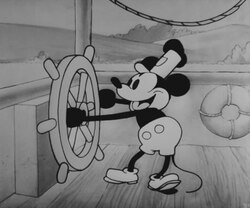

# Boat-Boat-Revolution

---
* Project Configuration

|Engine|Version|Language|
|------|-------|---------|
|Unity| 6000.4.6f1 |C#|

---

---

# Overview

Boat-Boat-Revolution is a music rhythm game inspired by Steamboat Willie.
Features full 8 minutes long of Steamboat Willie, as well as including the shortern 2 minute version of the song.

---

# Features

- ## Accuracy Detection
  - Detects when player presses key for lane
- ## Note Spawner
  - Spawns note corresponding the programmed timeline
- ## Score/Combo
  - Adds and holds score and combo count, corresponding to the player
- ## Score/Combo Progressive Visual Art
  - The art changes depends on the combo count and score through out the gameplay

---

# Core System
- ## Accuracy Detect
  - Use 3 Colliders to check accuracy in 5 degrees.
  - Calculates the score

- ## Timeline / Note Spawner
  - Note spawns based on the marker on timeline
  - Spawner Handles instanstiation for each lane
  - PlayableBehaviour handles the frame and timeline as well as PlayableBehaviour

---

# Controls

| Lane 1 | Lane 2 | Lane 3 | Lane 4 |
|--------|--------|--------|--------|
| 5      | T      | G      | B      |

---